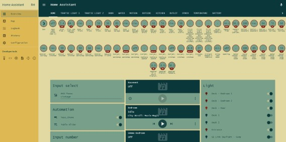
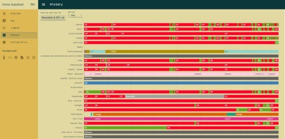

# HoppelLodge Home-Assistant Project

##### [full screen version](https://files.hoppel.us/home-assistant/ha_main_large.jpg)

---

### To-Do

- [X] DISABLED: [HA-Bridge](https://github.com/bwssytems/ha-bridge)
- [ ] [Integrate NEST into HA](https://www.home-assistant.io/components/nest)
- [ ] Integrate IoT Tardis into HA
- [X] OK: SmartThings battery levels are not being read
- [X] test if things work well after reboot
- [ ] [Integrate X-10 devices with HA](https://www.home-assistant.io/components/light.x10/)
- [ ] [apply security](https://www.home-assistant.io/docs/configuration/securing/)
- [X] [add IP Cam support](https://www.home-assistant.io/components/camera.generic/)
- [ ] [Customize entities](https://www.home-assistant.io/docs/configuration/customizing-devices/)

#### [Evernote Development Log (raspi2A)](https://www.evernote.com/l/AAP1ClDH_KNDMITT7rDInX9GBZm8hRmLzk8/)

### Recent Changes

- [12/4/2018] Initial implementation

### Synopsis

Implement an instance of [Home Assistant](https://www.home-assistant.io/) for the HoppelLodge which integrate all the existing [SmartThings](https://www.smartthings.com) devices.   This includes motion, contact, water detection, outlet, and smoke detection devices.  All the devices will also continue to be under the control of the [SmartThings Hub](https://www.smartthings.com/products/smartthings-hub).   The [SmartThings-MQTT-bridge](https://github.com/stjohnjohnson/smartthings-mqtt-bridge) will allow SmartThings devices to be monitored and controlled using [MQTT](https://en.wikipedia.org/wiki/MQTT) protocol.  This will all a quantum leap for future capabilities.  This platform will make possible the integration of the [IoT Tardis](http://demo.techdogs.us/) project which brings [Node-Red](https://nodered.org/) Integration using [IoT K9 modules](http://demo.techdogs.us/resources/png/IoT_TARDIS_Demo_bb.png) which uses [ES8266](https://en.wikipedia.org/wiki/ESP8266) low cost devices with incredible capabilities.

### Installation

- https://www.home-assistant.io/docs/installation/raspberry-pi/
- https://www.home-assistant.io/docs/configuration/securing/
- https://www.home-assistant.io/docs/autostart/systemd/

### local environment

- __~/.bash_aliases:__ local commands for easy HA operation

### [SmartThings-MQTT-Bridge](https://github.com/stjohnjohnson/smartthings-mqtt-bridge)

Node.js app which integrates SmartThings and MQTT

- config.yml configuration 
- PM2 manages operation

### [Home Assistant Configuration](https://github.com/home-assistant/home-assistant)

#### structure

- python3 app
- service: __"sudo systemd start home-assistant@pi"__
- directory: __~/.homeassistant__
  - themes: store alternates
  - resources: images, etc.

#### git repository

- https://github.com/rhoppel/home-assistant.git

#### configuration

- __automations.yaml__ : dimmer slider implementation
- __cameras.yaml__:  IP camera support
- __configuration.yaml:__ main configuration, references all yaml configs
- __customize.yaml:__ not used at this time 
- __groups.yaml:__ creates menu grouping using entities
- __inputs-select.yaml__ : theme selection 
- __lights.yaml:__ switch or dimming lights
- __secrets.yaml:__ stores passwords
- __scripts.yaml;__ not used at this time
- __sensors.yaml:__ motion, water, contact, temperature sensors
- __switches.yaml:__ outlets based switches
- __mqtt-topics:__ list of SmartThings MQTT topics
- __plex.conf:__ plex media player config [not working]
- __state.json:__ mqtt topics and saved state for a restartBB 

#### Anomalies

- groups.yaml: modified to accomodate the following
- enity instantiation: HA is not consistent with entities with the same name
  - HA has an algorhthm for instantiating entities with the same name
  - example:  this specific anomaly will cycle between different motion entities

##### MOTION DETECTOR  yaml configuration

    - platform: mqtt
      name: "Motion - Kitchen"
      state_topic: "smartthings/Motion - Kitchen/motion"
    - platform: mqtt
      name: "Motion - Kitchen"
      state_topic: "smartthings/Motion - Kitchen/temperature"
      unit_of_measurement: "°F"
    - platform: mqtt
      name: "Motion - Kitchen"
      state_topic: "smartthings/Motion - Kitchen/battery"
      unit_of_measurement: "%"

##### Entity Instantiation for above in order

- sensor.motion__kitchen [anomaly: temperature; should be: detection]
- sensor.motion__kitchen_2 [anomaly: battery; should be: temperature]
- sensor.motion__kitchen_3 [anomaly: detection; should be: battery]

## Screenshots

### Device Activity

---

##### [full screen version](https://files.hoppel.us/home-assistant/ha_activity_large.jpg)

---
